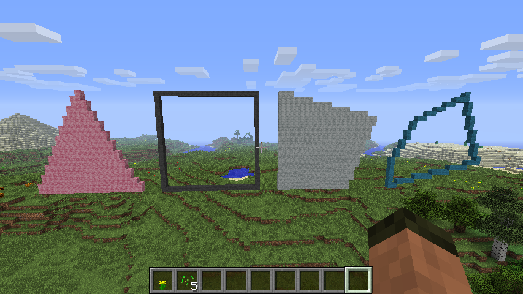

=====================
MinecraftDrawing API
=====================

The MinecraftDrawing API can be used to create lines, circles, spheres, and faces.

|polygons|

Example::

    from mcpi.minecraft import Minecraft
    from mcpi import block
    from minecraftstuff import MinecraftDrawing

    mc = Minecraft.create()

    mcdraw = MinecraftDrawing(mc)

    # draw a diagonal line
    mcdraw.drawLine(0,0,0,10,10,10,block.STONE.id)

.. automodule:: minecraftstuff

MinecraftDrawing
================

.. autoclass:: MinecraftDrawing
    :members:

Points
===============

.. autoclass:: Points
    :members:

