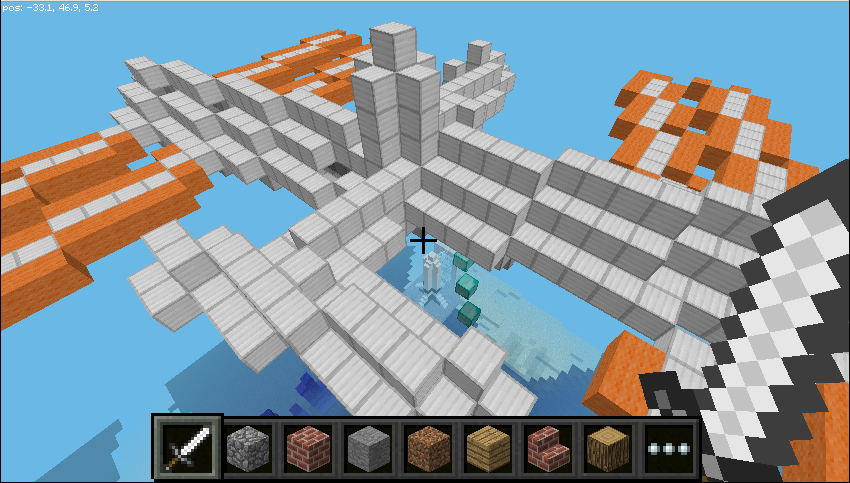

=====================
MinecraftShape API
=====================

The MinecraftShape API allows you create and manipulate shapes (collections of blocks) in Minecraft.

The shapes can be small or big and the API helps by efficiently moving them and only changing the blocks which have actually changed.

|issshape|

Example::

    from mcpi.minecraft import Minecraft
    from mcpi import block
    from minecraftstuff import MinecraftShape

    mc = minecraft.Minecraft.create()

    pos = mc.player.getTilePos()

    myShape = MinecraftShape(mc, pos)

    # create a big cube
    myShape.setBlocks(-5, -5, -5, 5, 5, 5, block.WOOL.id, 5)

    #move it 10 blocks up
    myshape.moveBy(0, 10, 0)

    #rotate it 45 degrees
    myshape.rotate(45, 0, 0)

.. automodule:: minecraftstuff

MinecraftShape
================

.. autoclass:: MinecraftShape
    :members:

ShapeBlock
===============

.. autoclass:: ShapeBlock
    :members:

