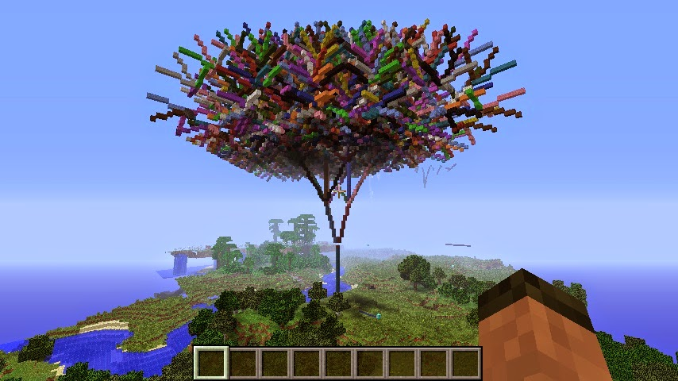

=====================
MinecraftTurtle
=====================

The Minecraft Turtle is a recreation of the classic graphics turtle for Minecraft. The key difference is that you can draw in 3 dimensions not just 2.

|fractaltree|

Example::

    from mcpi.minecraft import Minecraft
    from mcpi import block
    from minecraftstuff import MinecraftTurtle

    mc = minecraft.Minecraft.create()
    pos = mc.player.getTilePos()

    # create minecraft turtle
    steve = MinecraftTurtle(mc, pos)

    # draw a pentagon
    steve.forward(5)
    steve.right(72)
    steve.forward(5)
    steve.right(72)
    steve.forward(5)
    steve.right(72)
    steve.forward(5)
    steve.right(72)
    steve.forward(5)

.. automodule:: minecraftstuff

MinecraftTurtle
================

.. autoclass:: MinecraftTurtle
    :members:

